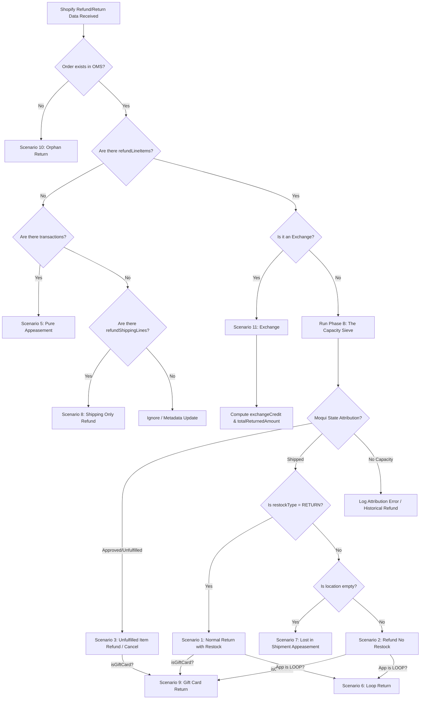

# Decision Tree: Shopify Returns & Refunds Integration

This document defines the logic used by the `create#ShopifyRefunds` service to classify Shopify data into business scenarios and attribute them correctly in Moqui/OMS.

## The Logic Flow

---

## 1. Primary Classification Nodes

### Node 1: The Orphan Check
- **Data Element**: `order.id` (Shopify) matched against `OrderHeader.externalId` (Moqui).
- **Outcome**: If missing, we cannot attribute to an existing order. We must create a standalone return context.

### Node 2: The Appeasement Check
- **Data Element**: `refund.refundLineItems` is empty AND `refund.transactions` is NOT empty.
- **Outcome**: This is **Scenario 5 (Pure Appeasement)**. No inventory is affected. Moqui should create a `ReturnItem` of type `Appeasement` or directly issue a `Invoice` credit.

### Node 3: The Exchange Detector
- **Data Elements**: 
    1. `order.exchangeV2s` exists.
    2. `refund.return.exchangeLineItems` exists.
    3. `agreements.app.title == "LOOP"` AND `restockType == NO_RESTOCK`.
- **Outcome**: **Scenario 11 (Exchange)**. Trigger `exchangeCredit` logic.

---

## 2. The Sieve (Attribution Logic)

When `refundLineItems` exist, we decide between **Cancel** and **Return** based on Moqui's inventory ownership.

| If Moqui Status is... | Condition | Scenario Deduction |
| :--- | :--- | :--- |
| **Approved / Pending** | `quantity <= cancelCapacity` | **Scenario 3**: Unfulfilled Item Refund. |
| **Shipped / Completed** | `quantity <= returnCapacity` | **Scenario 1 or 2**: Fulfilled Item Return. |

---

## 3. Secondary Signal Refinement

Once attributed as a **Return** (Shipped), we use Shopify flags to refine the "Successor" state:

### Scenario 1 vs 2 (Restock Intent)
- **Flag**: `restockType`.
- **Logic**: 
    - `RETURN` -> **Scenario 1** (Normal Return).
    - `NO_RESTOCK` -> **Scenario 2** (Refund only, no inventory impact).

### Scenario 7 (Lost in Shipment)
- **Flags**: `restockType == NO_RESTOCK` AND `location == null`.
- **Outcome**: This is a specific CSR appeasement for lost items.

### Scenario 6 (Loop Return)
- **Flag**: `agreements.app.title == "Loop Returns & Exchanges"`.
- **Outcome**: Signals third-party managed logic. Typically high-confidence for "Return" even if native signals are missing.

### Scenario 9 (Gift Card)
- **Flag**: `lineItem.isGiftCard == true`.
- **Outcome**: Special handling for non-SKU items.

---

## 4. Calculated Outputs

| Field | Source / Formula | Use Case |
| :--- | :--- | :--- |
| **totalReturnedAmount** | `subtotal + tax + adjustments` | Ledger balancing. |
| **exchangeCredit** | `totalReturnedAmount - cashRefunded` | Determining how much value was "swapped". |
| **A-Refund-Amt** | `refund.transactions.amount` | Actual cash impact. |
