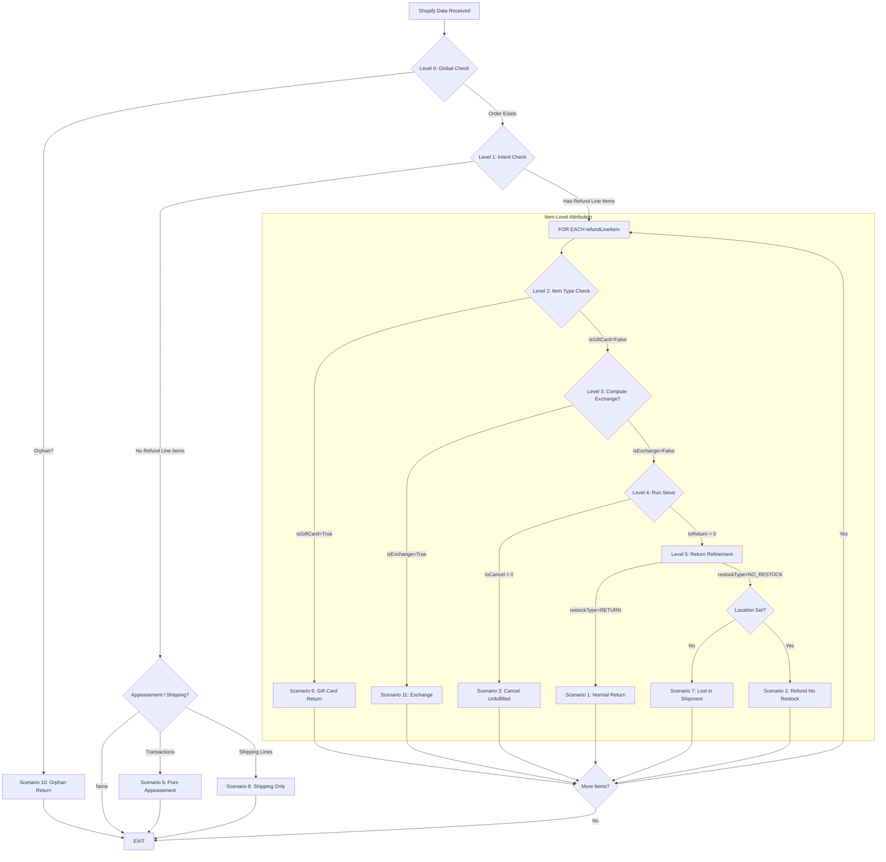

# Decision Tree: Shopify Returns & Refunds Integration

This document defines the logic used by the `create#ShopifyRefunds` service to classify Shopify data into business scenarios and attribute them correctly in Moqui/OMS.

## The Logic Flow

---

## 1. Primary Classification (Layered Execution)

### Level 0: Global Perimeter (Refund Level)
- **Check**: Does the Order ID exist in Moqui?
- **Computation**: Database lookup by `externalId`.
- **Exit Path**: If false, immediately drop into **Scenario 10 (Orphan)** and EXIT.

### Level 1: Intent Classification (Refund Level)
- **Check**: Are there `refundLineItems`?
- **Computation**: Count of items in the refund object.
- **Exit Path (No Items)**:
    - If `transactions` exist -> **Scenario 5 (Appeasement)**.
    - If `refundShippingLines` exist -> **Scenario 8 (Shipping Refund)**.
    - Otherwise -> **EXIT** (Metadata/Zero-Value Update).

---

## 2. Item-Level Decision Loop

For **each** `refundLineItem` in the Shopify refund, execute Levels 2 through 5. Every line item is independently attributed to exactly one scenario.

### Level 2: Item Type Check (isGiftCard?)
- **Check**: `lineItem.isGiftCard == true`.
- **Exit Path**: If true, handle as **Scenario 9 (Gift Card Return)** and proceed to next item. This bypasses physical inventory and exchange logic.

### Level 3: Actionable Context (Compute Exchange?)
- **Check**: Is this a physical exchange session?
- **Computation**: Check Native `exchangeV2s` OR Return `exchangeLineItems` OR Loop App Agreement.
- **Exit Path**: If `isExchange` is True, perform exchange-specific ledger allocation and proceed to next item.

### Level 4: The Sieve (Physical Attribution)
- **Check**: Distribute `quantity` based on Moqui State.
- **Lazy Computation**: Initialize "Capacity Pools" at the start of the service and subtract for each item processed.
    - `toCancel = min(rli.qty, cancelPool[sku])`
    - `toReturn = min(rli.qty - toCancel, returnPool[sku])`
- **Output**: 
    - If `toCancel > 0` -> Create `OrderCancel` / **Scenario 3**.
    - If `toReturn > 0` -> Proceed to Level 5 for restock refinement.

### Level 5: Return Refinement (Shopify Flags)
- **Check**: Shopify intent for the **shipped** portion (`toReturn`).
- **Scenario 1**: `restockType == RETURN` -> Standard Return.
- **Scenario 7**: `restockType == NO_RESTOCK` AND `location == null` -> Lost in Shipment Appeasement.
- **Scenario 2**: `restockType == NO_RESTOCK` AND `location != null` -> Damaged/Field Scrap.

---

## 3. Global Refinements (Level 6)

### Scenario 6: Loop Channel Attribution
- **Check**: Did the agreement come from the "Loop" app?
- **Computation**: Agreement lookup by `refundId`.
- **Outcome**: Override return source to "Loop" and apply specialized Loop return fee logic if applicable.

---

## 4. Calculated Outputs

| Field | Source / Formula | Use Case |
| :--- | :--- | :--- |
| **totalReturnedAmount** | `subtotal + tax + adjustments` | Ledger balancing. |
| **exchangeCredit** | `totalReturnedAmount - cashRefunded` | Determining how much value was "swapped". |
| **A-Refund-Amt** | `refund.transactions.amount` | Actual cash impact. |
