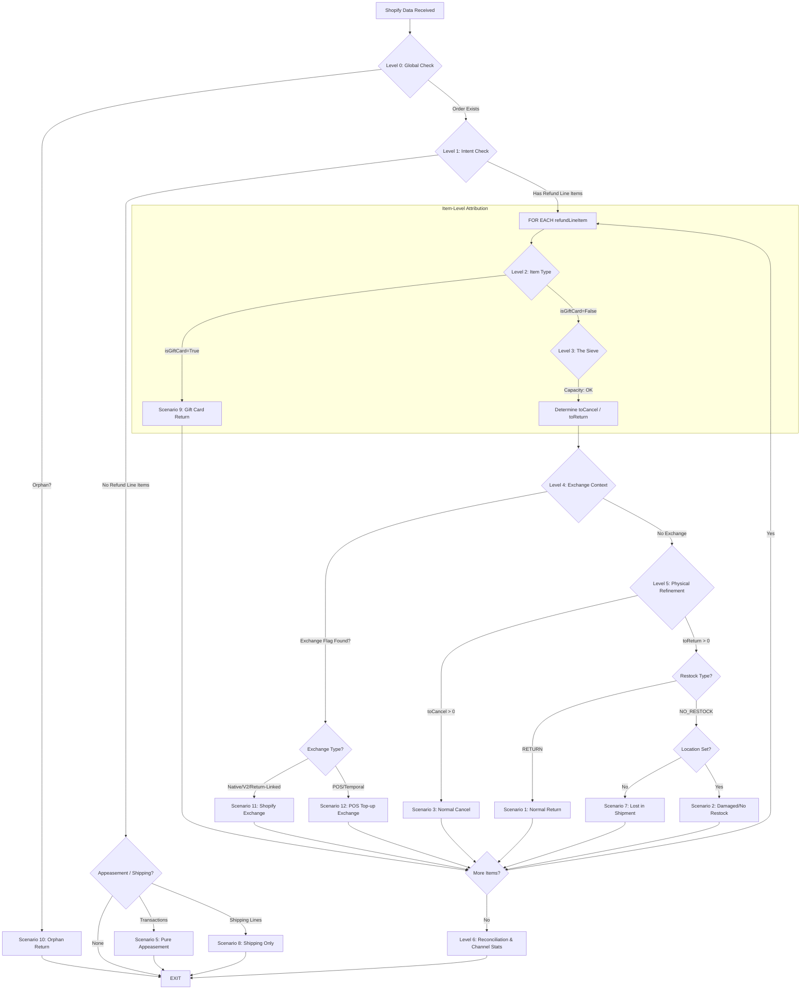

# Decision Tree: Shopify Returns & Refunds Integration

This document defines the logic used by the `create#ShopifyRefunds` service to classify Shopify data into business scenarios and attribute them correctly in Moqui/OMS.

## The Logic Flow

---

## 1. Primary Classification (Layered Execution)

### Level 0: Global Perimeter (Refund Level)
- **Check**: Does the Order ID exist in Moqui?
- **Computation**: Database lookup by `externalId`.
- **Exit Path**: If false, immediately drop into **Scenario 10 (Orphan)** and EXIT.

### Level 1: Intent Classification (Refund Level)
- **Check**: Are there `refundLineItems`?
- **Computation**: Count of items in the refund object.
- **Exit Path (No Items)**:
    - If `transactions` exist -> **Scenario 5 (Appeasement)**.
    - If `refundShippingLines` exist -> **Scenario 8 (Shipping Refund)**.
    - Otherwise -> **EXIT** (Metadata/Zero-Value Update).

---

## 2. Item-Level Decision Loop

For **each** `refundLineItem` in the Shopify refund, we first attribute the item physically, then qualify it with financial context.

### Level 2: Item Type (isGiftCard?)
- **Condition**: `lineItem.isGiftCard == true`.
- **Exit Path**: Handle as **Scenario 9 (Gift Card Return)** and proceed to next item.

### Level 3: The Sieve (Physical Attribution)
- **Computation**: Determine `toCancel` and `toReturn` based on Moqui Capacity Pools.
- **Output**: Physical quantities used for the next levels.

### Level 4: Exchange Context (Financial Attribution)
The system checks three primary signals to identify the "Exchange Relationship":
1. **Shopify Native (V2)**: Order has `exchangeV2s` additions. (**Scenario 11**)
2. **Shopify Return-Linked**: `refund.return.exchangeLineItems` is non-empty. (**Scenario 11**)
3. **POS Temporal Rule**: $0 Cash Refund followed immediately by a `SALE` transaction. (**Scenario 12**)

*Note: If any of these signals are present, the item value is attributed as "Exchange Credit" in the financial reconciliation.*

### Level 5: Physical Refinement (Non-Exchange Only)
If no exchange relationship is detected, calibrate the intent for the `toReturn` portion:
- **Scenario 1**: Standard Return (`RETURN`).
- **Scenario 7**: Lost in Shipment (`NO_RESTOCK` + location=null).
- **Scenario 2**: Damaged/No Restock (`NO_RESTOCK` + location!=null).
- **Scenario 3**: Standard Cancel (from `toCancel` portion).

---

## 3. Reconciliation & Attribution (Level 6)

After all line items are processed, the service performs the final financial and metadata balancing:

1. **Exchange Reconciliation**:
    - `totalReturnedAmount = Sum(itemValue) + shippingRefund`
    - `aRefundAmt (Cash Out) = Sum(refundTransactions)`
    - `exchangeCredit = totalReturnedAmount - aRefundAmt`
2. **Channel/Origin Attribution**:
    - If a `refundAgreement.app.title` is present (e.g., "Loop"), tag the Moqui `ReturnHeader.originEnumId` accordingly. Loop is treated as **metadata** to track the return's origin, not a logic-branching signal.

---

## 4. Calculated Outputs

| Field | Source / Formula | Use Case |
| :--- | :--- | :--- |
| **totalReturnedAmount** | `subtotal + tax + adjustments` | Ledger balancing. |
| **exchangeCredit** | `totalReturnedAmount - cashRefunded` | Determining how much value was "swapped". |
| **A-Refund-Amt** | `refund.transactions.amount` | Actual cash impact. |
