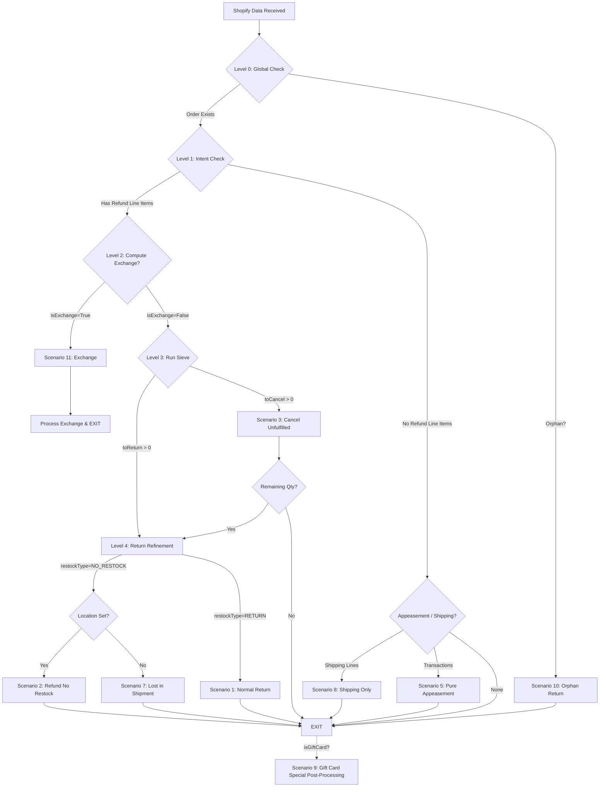

# Decision Tree: Shopify Returns & Refunds Integration

This document defines the logic used by the `create#ShopifyRefunds` service to classify Shopify data into business scenarios and attribute them correctly in Moqui/OMS.

## The Logic Flow

---

## 1. Primary Classification (Layered Execution)

### Level 0: Global Perimeter
- **Check**: Does the Order ID exist in Moqui?
- **Computation**: Database lookup by `externalId`.
- **Exit Path**: If false, immediately drop into **Scenario 10 (Orphan)**.

### Level 1: Intent Classification (Root Level)
- **Check**: Are there `refundLineItems`?
- **Computation**: Count of items in the refund object.
- **Exit Path (No Items)**:
    - If `transactions` exist -> **Scenario 5 (Appeasement)**.
    - If `refundShippingLines` exist -> **Scenario 8 (Shipping Refund)**.
    - Otherwise -> **EXIT** (Metadata/Zero-Value Update).

### Level 2: Actionable Context (Compute Exchange)
- **Lazy Computation**: This Boolean is only computed if Level 1 confirms we have items.
- **Computation**: Check Native `exchangeV2s` OR Return `exchangeLineItems` OR Loop App Agreement.
- **Exit Path**: If `isExchange` is True, perform exchange-specific ledger allocation and **EXIT**.

---

## 2. The Sieve (Level 3: Attribution)

Performed only if `isExchange` is False.

- **Check**: Distribute `quantity` based on Moqui State.
- **Computation**: 
    - `toCancel = min(qty, moquiApproved)`
    - `toReturn = min(qty - toCancel, moquiShipped)`
- **Exit Path**: If `toCancel` exists, process cancel. If `toReturn > 0`, proceed to Level 4.

---

## 3. Return Refinement (Level 4: Shopify Flags)

Performed only for the `toReturn` portion of the quantity.

- **Check**: What is the Shopify intent for the shipped item?
- **Scenario 1**: `restockType == RETURN` -> Standard Return.
- **Scenario 7**: `restockType == NO_RESTOCK` AND `location == null` -> Lost in Shipment Appeasement.
- **Scenario 2**: `restockType == NO_RESTOCK` AND `location != null` -> Damaged/Field Scrap (Refund but no stock).

---

## 4. Post-Processing Hooks (Parallel)

These logic blocks run after the primary scenario is decided, before final exit.

- **Scenario 9 (Gift Card)**: If `isGiftCard = true`, bypass SKU validation and map to gift card GL accounts.
- **Scenario 6 (Loop)**: If Agreement App is "Loop", override the return source/channel.

---

## 4. Calculated Outputs

| Field | Source / Formula | Use Case |
| :--- | :--- | :--- |
| **totalReturnedAmount** | `subtotal + tax + adjustments` | Ledger balancing. |
| **exchangeCredit** | `totalReturnedAmount - cashRefunded` | Determining how much value was "swapped". |
| **A-Refund-Amt** | `refund.transactions.amount` | Actual cash impact. |
