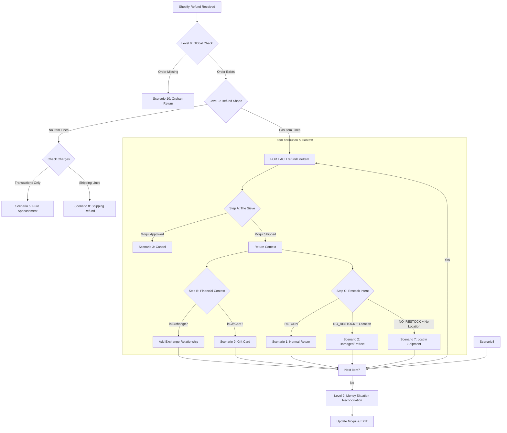

# Decision Tree: Shopify Returns & Refunds Refactored

This document defines the core logic for the `create#ShopifyRefunds` service, focusing on accurate inventory attribution and financial reconciliation.

## 1. The Decision Hierarchy

---

## 2. Core Logic Definitions

### Level 0: Global Perimeter
- **Check**: Database lookup of `OrderHeader.externalId` using Shopify Order ID.
- **Outcome**: If missing, treat as an **Orphan Return (Scenario 10)**.

### Level 1: Refund Shape
- If `refundLineItems` is empty, determine if it's **Pure Appeasement (Scenario 5)** or a **Shipping Refund (Scenario 8)** based on transaction and shipping line presence.

---

## 3. Item-Level Attribution (Decoupled Sieve)

For every line item in the refund, we apply the following logic sequentially:

### Step A: The Physical Sieve (Capacity Attribution)
Based on Moqui's inventory state, we distribute the quantity:
1. **toCancel**: `min(qty, moquiApprovedPool)` -> **Cancel Unfulfilled (Scenario 3)**.
2. **toReturn**: `min(qty - toCancel, moquiShippedPool)` -> Proceed to Return Context.

### Step B: Financial Context (Overlays)
These flags qualify the return but do not change its physical status:
- **Exchange Relationship**: Identify if the item is part of an exchange session (Native V2, Return exchange items, or POS Temporal Salle).
- **Gift Card**: If `isGiftCard = true`, bypass physical inventory movement.

### Step C: Restock intent (Refinement)
For the `toReturn` portion, identify the inventory impact:
- **Scenario 1**: Standard Return (`RETURN`).
- **Scenario 7**: Lost in Shipment (`NO_RESTOCK` with no location set).
- **Scenario 2**: Damaged / Field Scrap (`NO_RESTOCK` with location set).

---

## 4. Money Situation Reconciliation (Level 2)

Final financial balancing for the entire refund:
1. **totalReturnedAmount**: The gross value of all returned/cancelled items + shipping refund.
2. **aRefundAmt**: The actual cash-out value from Shopify `transactions`.
3. **exchangeCredit**: `totalReturnedAmount - aRefundAmt`. This value represents the financial "swap" to be applied to new items or credit memos.

---

## 5. Channel Attribution (Metadata)
- **Origin**: Use `refundAgreement.app.title` (e.g., "Loop", "POS") as metadata to track the channel, without forking the primary logic.
